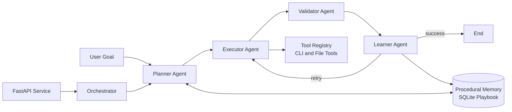

# Nexus-Agent

Nexus-Agent is a task-oriented Multi-AI Agent orchestration project for planning, implementing, validating, and continuously improving software tasks.

The repository includes:
- A FastAPI runtime entrypoint for container deployment and operational health endpoints.
- Structured agent contracts using Pydantic models.
- Multi-agent role implementations (architect, developer, optimizer).
- An experimental LangGraph control loop with automatic skill learning backed by SQLite.
- Docker, Docker Compose, and Portainer-ready deployment assets.

## Current Status

- Production-oriented service shell is available via FastAPI in [nexus_agent/entrypoint.py](nexus_agent/entrypoint.py).
- Core models and agent classes are implemented and tested in [nexus_agent/core/models.py](nexus_agent/core/models.py) and [nexus_agent/agents](nexus_agent/agents).
- LangGraph planner-executor-validator-learner orchestration exists in [nexus_agent/core/orchestrator.py](nexus_agent/core/orchestrator.py) and is under active iteration.
- Containerized deployment is ready using [Dockerfile](Dockerfile), [docker-compose.yml](docker-compose.yml), and [Stack.env](Stack.env).

## High-Level Architecture



## Repository Layout

```text
.
|- nexus_agent/
|  |- agents/         # Agent role implementations
|  |- core/           # Orchestration, memory, state, gateway, runtime modules
|  |- prompts/        # Prompt templates
|  |- tools/          # Tool registry and system tools
|  |- utils/          # Utility functions (diff utilities, etc.)
|- tests/             # Unit tests
|- Dockerfile         # Multi-stage production image
|- docker-compose.yml # Local and Portainer stack definition
|- Stack.env          # Environment variable template
|- start_vllm.bat     # Optional local vLLM server launcher
```

## Requirements

- Python 3.10+
- pip
- Docker and Docker Compose (optional, for container deployment)

## Quick Start (Local Development)

1. Create and activate a virtual environment.

```powershell
python -m venv .venv
.\.venv\Scripts\Activate.ps1
```

2. Install dependencies.

```powershell
python -m pip install --upgrade pip setuptools wheel
pip install -r requirements.txt
pip install -e ".[dev]"
```

3. Optional: install experimental orchestration runtime dependency for planner and learner modules.

```powershell
pip install langchain-openai
```

4. Run the API service.

```powershell
uvicorn nexus_agent.entrypoint:app --host 0.0.0.0 --port 8080 --reload
```

5. Verify service endpoints.

```powershell
curl http://localhost:8080/
curl http://localhost:8080/health
curl http://localhost:8080/ready
curl http://localhost:8080/info
```

## API Endpoints

| Endpoint | Purpose | Notes |
| --- | --- | --- |
| / | Service metadata and endpoint discovery | Always enabled |
| /health | Liveness probe | Returns service uptime and version |
| /ready | Readiness probe | Reports configured dependencies from env vars |
| /info | Runtime and configuration metadata | Includes Python version and selected env config |
| /docs | OpenAPI docs | Enabled only when ENVIRONMENT is not production |
| /redoc | ReDoc docs | Enabled only when ENVIRONMENT is not production |

## Run Tests

```powershell
python -m pytest -v --tb=short
```

## Docker (Single Container)

Build image:

```powershell
docker build -t nexus-agent:latest .
```

Run container:

```powershell
docker run --rm -p 8080:8080 --env-file Stack.env nexus-agent:latest
```

## Docker Compose and Portainer Stack

Start the full stack (API + Redis + PostgreSQL):

```powershell
docker compose --env-file Stack.env up -d
```

Common operations:

```powershell
docker compose ps
docker compose logs -f nexus-agent
docker compose down
```

The same [docker-compose.yml](docker-compose.yml) and [Stack.env](Stack.env) files can be used in Portainer Stacks.

## Environment Configuration

Main variables are defined in [Stack.env](Stack.env). Important settings include:

- Application: ENVIRONMENT, APP_VERSION, NEXUS_PORT, LOG_LEVEL, WEB_CONCURRENCY
- Model provider: OPENAI_API_KEY, OPENAI_BASE_URL, OPENAI_MODEL
- Optional local inference: VLLM_ENABLED, VLLM_MODEL_NAME, VLLM_HOST, VLLM_PORT
- Data services: REDIS_PASSWORD, POSTGRES_USER, POSTGRES_PASSWORD, POSTGRES_DB

To enable interactive API docs locally:

- Set ENVIRONMENT=development
- Restart the service
- Open /docs or /redoc

## Optional: Run Local vLLM

If you want OpenAI-compatible local inference, use [start_vllm.bat](start_vllm.bat):

```powershell
start_vllm.bat
```

Then point the application to your local endpoint:

- OPENAI_BASE_URL=http://localhost:8000/v1
- OPENAI_MODEL=<your_model_name>

## CI/CD

GitHub Actions workflow [ci-cd.yml](.github/workflows/ci-cd.yml) implements:

1. Test and coverage collection.
2. Docker build and push to GHCR.
3. Portainer webhook deployment.

## Project Documentation

- [Automatic Skill Learning and Repository Implementation](docs/Automatic%20Skill%20Learning%20%26%20Repository%20Implementation.md)
- [Evolving Nexus-Agent into a Task-Oriented Multi-Agent System](docs/Evolving%20Nexus-Agent%20into%20a%20Task-Oriented%20Multi-Agent%20System.md)
- [Nexus-Agent Automatic Skill Learning Implementation](docs/Nexus-Agent%20Automatic%20Skill%20Learning%20Implementation.md)
- [Nexus-Agent Migration Walkthrough](docs/Nexus-Agent%20Migration%20Walkthrough.md)
- [Nexus-Agent System Implementation Walkthrough](docs/Nexus-Agent%20System%20Implementation%20Walkthrough.md)
- [Nexus-Agent Multi-AI Agent System Documentation](docs/Nexus-Agent_%20Multi-AI%20Agent%20System%20Documentation.md)
- [Nexus-Agent HTML Documentation](docs/Nexus-Agent-Documentation.html)

## Contributing

1. Create a feature branch from main.
2. Make changes with tests.
3. Run local checks and test suite.
4. Open a pull request.

## License

No license file is currently present in this repository.
