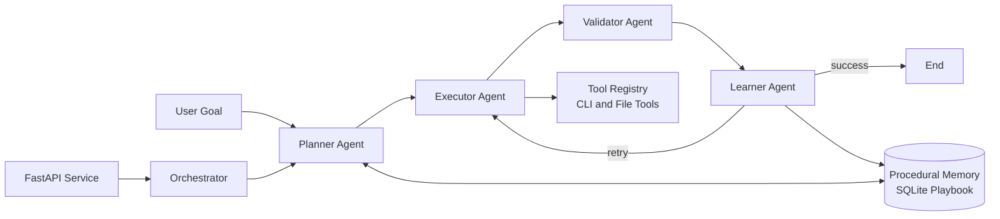

# Nexus-Agent

Nexus-Agent is a task-oriented Multi-AI Agent orchestration project for planning, implementing, validating, and continuously improving software tasks.

The repository includes:

- A FastAPI runtime entrypoint for container deployment and operational health endpoints.
- Structured agent contracts using Pydantic models.
- Multi-agent role implementations (architect, developer, optimizer).
- An experimental LangGraph control loop with automatic skill learning backed by SQLite.
- Docker, Docker Compose, and Portainer-ready deployment assets.

## Current Status

- Production-oriented service shell is available via FastAPI in [nexus_agent/entrypoint.py](nexus_agent/entrypoint.py).
- Core models and agent classes are implemented and tested in [nexus_agent/core/models.py](nexus_agent/core/models.py) and [nexus_agent/agents](nexus_agent/agents).
- LangGraph planner-executor-validator-learner orchestration exists in [nexus_agent/core/orchestrator.py](nexus_agent/core/orchestrator.py) and is under active iteration.
- AST-based Knowledge Graph Engine is implemented in [nexus_agent/core/knowledge_graph_engine.py](nexus_agent/core/knowledge_graph_engine.py).
- Persistent Skill Vault and Local Deep Research engine are implemented in [nexus_agent/core/skill_vault.py](nexus_agent/core/skill_vault.py).
- Containerized deployment is ready using [Dockerfile](Dockerfile), [docker-compose.yml](docker-compose.yml), and [Stack.env](Stack.env).

## New Engines (v0.2)

The repository now includes two major capability layers inspired by GitNexus, awesome-codex-skills, and OpenAGI style workflows:

1. Knowledge Graph Engine
1. Persistent Skill Vault

### Knowledge Graph Engine

- Convert repository into AST graph.
- See function calls and dependency links across files.
- Trace execution flow from selected entry symbol.
- Analyze blast radius before code changes.
- Plan synchronized cross-file refactor (identifier rename).
- Generate automatic wiki pages from graph metadata.

### Persistent Skill Vault

- Store skills in persistent SQLite memory with maturity scoring.
- Import markdown skills (for example from awesome-codex-skills style repositories).
- Search or suggest skills by task intent.
- Record execution feedback and evolve skill quality.
- Run local deep research with optional repository graph signals.
- Generate autonomous human-like task plans from skill memory and rules.

## High-Level Architecture



## Repository Layout

```text
.
|- nexus_agent/
|  |- agents/         # Agent role implementations
|  |- core/           # Orchestration, memory, state, gateway, runtime modules
|  |- prompts/        # Prompt templates
|  |- tools/          # Tool registry and system tools
|  |- utils/          # Utility functions (diff utilities, etc.)
|- tests/             # Unit tests
|- Dockerfile         # Multi-stage production image
|- docker-compose.yml # Local and Portainer stack definition
|- Stack.env          # Environment variable template
|- start_vllm.bat     # Optional local vLLM server launcher
```

## Requirements

- Python 3.10+
- pip
- Docker and Docker Compose (optional, for container deployment)

## Quick Start (Local Development)

1. Create and activate a virtual environment.

```powershell
python -m venv .venv
.\.venv\Scripts\Activate.ps1
```

1. Install dependencies.

```powershell
python -m pip install --upgrade pip setuptools wheel
pip install -r requirements.txt
pip install -e ".[dev]"
```

1. Optional: install experimental orchestration runtime dependency for planner and learner modules.

```powershell
pip install langchain-openai
```

1. Run the API service.

```powershell
uvicorn nexus_agent.entrypoint:app --host 0.0.0.0 --port 8080 --reload
```

1. Verify service endpoints.

```powershell
curl http://localhost:8080/
curl http://localhost:8080/health
curl http://localhost:8080/ready
curl http://localhost:8080/info
```

## API Endpoints

| Endpoint | Purpose | Notes |
| --- | --- | --- |
| / | Service metadata and endpoint discovery | Always enabled |
| /health | Liveness probe | Returns service uptime and version |
| /ready | Readiness probe | Reports configured dependencies from env vars |
| /info | Runtime and configuration metadata | Includes Python version and selected env config |
| /kg/build | Build repository AST graph | Caches graph for trace and blast-radius endpoints |
| /kg/trace | Trace execution flow | Requires built graph |
| /kg/blast-radius | Analyze impact scope | Requires built graph |
| /kg/refactor | Plan or apply synchronized refactor | Identifier-level rename across files |
| /kg/wiki | Generate graph-driven wiki | Writes markdown pages to output directory |
| /skills/add | Add or update one skill | Persistent storage in SQLite |
| /skills/import | Import markdown skill library | Useful for awesome-codex-skills style content |
| /skills/import-github | Import skills from GitHub/local git source | Auto sync then ingest markdown skills |
| /skills/search | Search skills | Full-text + tags |
| /skills/suggest | Suggest skills for a task | Relevance-ranked |
| /skills/execution | Record execution feedback | Updates maturity and success metrics |
| /skills/research | Local deep research | Uses skills plus optional graph signals |
| /skills/autonomous-plan | Generate autonomous task plan | Human-like planning pattern |
| /docs | OpenAPI docs | Enabled only when ENVIRONMENT is not production |
| /redoc | ReDoc docs | Enabled only when ENVIRONMENT is not production |

## Example Workflows

Build graph:

```powershell
curl -X POST http://localhost:8080/kg/build -H "Content-Type: application/json" -d "{}"
```

Trace execution flow:

```powershell
curl -X POST http://localhost:8080/kg/trace -H "Content-Type: application/json" -d '{"entry_symbol":"nexus_agent.core.orchestrator.Orchestrator.run_task","max_depth":6}'
```

Blast radius before edit:

```powershell
curl -X POST http://localhost:8080/kg/blast-radius -H "Content-Type: application/json" -d '{"changed_symbols":["nexus_agent.core.memory.ProceduralMemory.add_rule"],"depth":2}'
```

Plan synchronized refactor:

```powershell
curl -X POST http://localhost:8080/kg/refactor -H "Content-Type: application/json" -d '{"rename_map":{"old_name":"new_name"},"apply_changes":false}'
```

Generate wiki:

```powershell
curl -X POST http://localhost:8080/kg/wiki -H "Content-Type: application/json" -d '{"output_dir":"docs/graph-wiki"}'
```

Add and search skills:

```powershell
curl -X POST http://localhost:8080/skills/add -H "Content-Type: application/json" -d '{"name":"Blast Radius Analysis","summary":"Analyze impact before edit","description_md":"Use graph before refactor","tags":["graph","refactor"]}'
curl -X POST http://localhost:8080/skills/search -H "Content-Type: application/json" -d '{"query":"blast radius for refactor","top_k":5}'
```

Run local deep research:

```powershell
curl -X POST http://localhost:8080/skills/research -H "Content-Type: application/json" -d '{"topic":"safe multi-file refactor strategy","top_k":5,"include_repo_signals":true}'
```

Generate autonomous plan:

```powershell
curl -X POST http://localhost:8080/skills/autonomous-plan -H "Content-Type: application/json" -d '{"task_text":"analyze blast radius and refactor safely","top_k":5}'
```

## Import External Skill Libraries

To import a local clone of a markdown-based skill repository:

```powershell
curl -X POST http://localhost:8080/skills/import -H "Content-Type: application/json" -d '{"directory":"C:/path/to/awesome-codex-skills","source":"awesome-codex-skills"}'
```

To import directly from GitHub (clone or pull automatically):

```powershell
curl -X POST http://localhost:8080/skills/import-github -H "Content-Type: application/json" -d '{"repo_url":"https://github.com/owner/awesome-codex-skills.git","branch":"main","source":"awesome-codex-skills"}'
```

This allows Nexus-Agent to keep a persistent, evolving skill memory for Local Deep Research and autonomous planning.

## Run Tests

```powershell
python -m pytest -v --tb=short
```

## Docker (Single Container)

Build image:

```powershell
docker build -t nexus-agent:latest .
```

Run container:

```powershell
docker run --rm -p 8080:8080 --env-file Stack.env nexus-agent:latest
```

## Docker Compose and Portainer Stack

Start the full stack (API + Redis + PostgreSQL):

```powershell
docker compose --env-file Stack.env up -d
```

Common operations:

```powershell
docker compose ps
docker compose logs -f nexus-agent
docker compose down
```

The same [docker-compose.yml](docker-compose.yml) and [Stack.env](Stack.env) files can be used in Portainer Stacks.

## Environment Configuration

Main variables are defined in [Stack.env](Stack.env). Important settings include:

- Application: ENVIRONMENT, APP_VERSION, NEXUS_PORT, LOG_LEVEL, WEB_CONCURRENCY
- Model provider: OPENAI_API_KEY, OPENAI_BASE_URL, OPENAI_MODEL
- Optional local inference: VLLM_ENABLED, VLLM_MODEL_NAME, VLLM_HOST, VLLM_PORT
- Data services: REDIS_PASSWORD, POSTGRES_USER, POSTGRES_PASSWORD, POSTGRES_DB

To enable interactive API docs locally:

- Set ENVIRONMENT=development
- Restart the service
- Open /docs or /redoc

## Optional: Run Local vLLM

If you want OpenAI-compatible local inference, use [start_vllm.bat](start_vllm.bat):

```powershell
start_vllm.bat
```

Then point the application to your local endpoint:

- OPENAI_BASE_URL=<http://localhost:8000/v1>
- OPENAI_MODEL=<your_model_name>

## CI/CD

GitHub Actions workflow [ci-cd.yml](.github/workflows/ci-cd.yml) implements:

1. Test and coverage collection.
1. Docker build and push to GHCR.
1. Portainer webhook deployment.

## Project Documentation

- [Automatic Skill Learning and Repository Implementation](docs/Automatic%20Skill%20Learning%20%26%20Repository%20Implementation.md)
- [Evolving Nexus-Agent into a Task-Oriented Multi-Agent System](docs/Evolving%20Nexus-Agent%20into%20a%20Task-Oriented%20Multi-Agent%20System.md)
- [Nexus-Agent Automatic Skill Learning Implementation](docs/Nexus-Agent%20Automatic%20Skill%20Learning%20Implementation.md)
- [Nexus-Agent Migration Walkthrough](docs/Nexus-Agent%20Migration%20Walkthrough.md)
- [Nexus-Agent System Implementation Walkthrough](docs/Nexus-Agent%20System%20Implementation%20Walkthrough.md)
- [Nexus-Agent Multi-AI Agent System Documentation](docs/Nexus-Agent_%20Multi-AI%20Agent%20System%20Documentation.md)
- [Nexus-Agent HTML Documentation](docs/Nexus-Agent-Documentation.html)

## Contributing

1. Create a feature branch from main.
1. Make changes with tests.
1. Run local checks and test suite.
1. Open a pull request.

## License

No license file is currently present in this repository.
