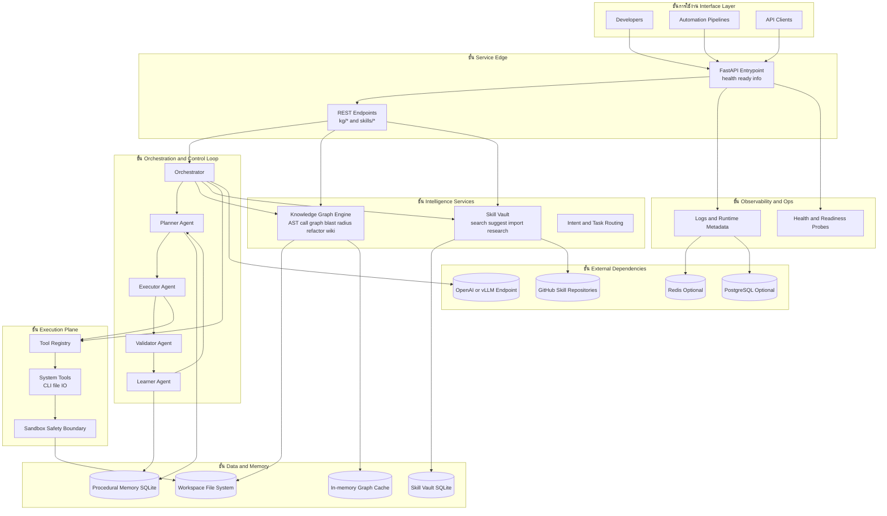

# คู่มือสถาปัตยกรรมระบบขั้นสูงและวิธีใช้งาน Nexus-Agent

เอกสารนี้ครอบคลุม:

- แผนภาพสถาปัตยกรรมระบบขั้นสูงของ Nexus-Agent
- วิธีใช้งานแบบปฏิบัติจริงทั้งโหมด local และ container
- แนวทางใช้งานแบบปลอดภัยสำหรับงาน refactor, skill learning และ autonomous planning

อ่านเวอร์ชันภาษาอังกฤษได้ที่:

- [Nexus-Agent Advanced System Architecture and Usage Guide](Advanced-System-Architecture-and-Usage-Guide.md)

## 1. แผนภาพสถาปัตยกรรมระบบขั้นสูง

ไฟล์ภาพแบบคงที่สำหรับใช้งานในสไลด์:

- [SVG: advanced-system-architecture-diagram.svg](advanced-system-architecture-diagram.svg)
- [PNG: advanced-system-architecture-diagram.png](advanced-system-architecture-diagram.png)




## 2. วงจรควบคุมการทำงาน Runtime Control Loop

Nexus-Agent ใช้ลูปการทำงานแบบ task-oriented:

1. Planner แยกเป้าหมายเป็นขั้นตอนที่ทำงานได้จริง
1. Executor เรียกใช้เครื่องมือและลงมือกับ workspace
1. Validator ประเมินผลลัพธ์และสัญญาณคุณภาพ
1. Learner บันทึกรูปแบบที่ใช้ซ้ำได้เพื่อรอบถัดไป
1. หากยังไม่ผ่านเงื่อนไข จะวนกลับไปวางแผนและทำซ้ำ

แนวทางนี้ช่วยให้ระบบค่อยๆ converge ไปสู่ผลลัพธ์ที่ถูกต้อง แทนการสร้างคำตอบแบบครั้งเดียวจบ

## 3. คู่มือการใช้งาน

## 3.1 ข้อกำหนดเบื้องต้น

- Python 3.10 ขึ้นไป
- pip
- Docker และ Docker Compose (ถ้าต้องการรันแบบ container)
- git binary (ถ้าต้องการ import skill จาก remote repository)

## 3.2 ตั้งค่าสภาพแวดล้อม

```powershell
python -m venv .venv
.\.venv\Scripts\Activate.ps1
python -m pip install --upgrade pip setuptools wheel
pip install -r requirements.txt
pip install -e ".[dev]"
```

ถ้าต้องการเชื่อมกับ orchestration model:

```powershell
pip install langchain-openai
```

## 3.3 เริ่มรันบริการ

```powershell
uvicorn nexus_agent.entrypoint:app --host 0.0.0.0 --port 8080 --reload
```

ตรวจสอบสถานะบริการ:

```powershell
curl http://localhost:8080/health
curl http://localhost:8080/ready
curl http://localhost:8080/info
```

## 3.4 Workflow สำหรับ Knowledge Graph

1. สร้าง graph cache

```powershell
curl -X POST http://localhost:8080/kg/build -H "Content-Type: application/json" -d "{}"
```

1. Trace call flow จาก entry symbol

```powershell
curl -X POST http://localhost:8080/kg/trace -H "Content-Type: application/json" -d '{"entry_symbol":"app.main","max_depth":6}'
```

1. ประเมิน blast radius ก่อนแก้โค้ด

```powershell
curl -X POST http://localhost:8080/kg/blast-radius -H "Content-Type: application/json" -d '{"changed_symbols":["service.run_service"],"depth":2}'
```

1. วางแผน synchronized refactor

```powershell
curl -X POST http://localhost:8080/kg/refactor -H "Content-Type: application/json" -d '{"rename_map":{"old_name":"new_name"},"apply_changes":false}'
```

1. สร้าง wiki จาก graph

```powershell
curl -X POST http://localhost:8080/kg/wiki -H "Content-Type: application/json" -d '{"output_dir":"docs/graph-wiki"}'
```

## 3.5 Workflow สำหรับ Skill Vault

1. เพิ่มหรืออัปเดต skill

```powershell
curl -X POST http://localhost:8080/skills/add -H "Content-Type: application/json" -d '{"name":"Blast Radius Analysis","summary":"Analyze impact before editing","description_md":"Use dependency and call graph","tags":["graph","refactor"]}'
```

1. นำเข้า skills จากโฟลเดอร์ markdown ในเครื่อง

```powershell
curl -X POST http://localhost:8080/skills/import -H "Content-Type: application/json" -d '{"directory":"C:/path/to/skills","source":"awesome-codex-skills"}'
```

1. นำเข้า skills จาก GitHub โดยตรง (clone หรือ pull อัตโนมัติ)

```powershell
curl -X POST http://localhost:8080/skills/import-github -H "Content-Type: application/json" -d '{"repo_url":"https://github.com/owner/awesome-codex-skills.git","branch":"main","source":"awesome-codex-skills"}'
```

1. ค้นหาและแนะนำ skills ที่เกี่ยวข้อง

```powershell
curl -X POST http://localhost:8080/skills/search -H "Content-Type: application/json" -d '{"query":"blast radius refactor","top_k":5}'
curl -X POST http://localhost:8080/skills/suggest -H "Content-Type: application/json" -d '{"query":"safe refactor workflow","top_k":5}'
```

1. บันทึกผลการใช้งาน skill เพื่อพัฒนา maturity

```powershell
curl -X POST http://localhost:8080/skills/execution -H "Content-Type: application/json" -d '{"skill_ref":"Refactor Safety","successful":true,"feedback":"Validated in integration run"}'
```

1. สร้าง deep research และ autonomous task plan

```powershell
curl -X POST http://localhost:8080/skills/research -H "Content-Type: application/json" -d '{"topic":"safe multi-file refactor strategy","top_k":5,"include_repo_signals":true}'
curl -X POST http://localhost:8080/skills/autonomous-plan -H "Content-Type: application/json" -d '{"task_text":"analyze blast radius and refactor safely","top_k":5}'
```

## 4. รูปแบบการใช้งานขั้นสูงที่แนะนำ

สำหรับงานวิศวกรรมที่ต้องการความปลอดภัยสูง ให้ใช้ลำดับนี้:

1. Build graph
1. Trace execution path จาก entrypoint ที่เกี่ยวข้อง
1. คำนวณ blast radius ของ symbol ที่จะเปลี่ยน
1. สร้าง refactor plan แบบ dry-run ก่อน
1. Apply เฉพาะเมื่อผ่าน validation checkpoint
1. บันทึกผลลัพธ์กลับเข้า Skill Vault เพื่อ reuse ในรอบถัดไป

## 5. แนวทางออกแบบสำหรับ Production

- รัน API แบบ stateless หลาย replicas
- ผูกฐานข้อมูล SQLite เข้ากับ durable volumes
- แยก endpoint ของ model ออกจากบริการ API หลัก
- เพิ่ม reverse proxy, auth และ rate limit ก่อนเปิด external access
- ผูก health และ readiness probe เข้ากับแพลตฟอร์ม orchestration

## 6. แนวทางแก้ปัญหาเบื้องต้น

- import จาก GitHub ไม่สำเร็จเพราะไม่พบ git:
  ติดตั้ง git และตรวจสอบว่าอยู่ใน PATH
- /kg/trace หรือ /kg/blast-radius แจ้งว่าไม่พบ graph context:
  เรียก /kg/build ก่อน โดยใช้ repo root เดียวกัน
- ระบบไม่แนะนำ skill:
  เพิ่ม skill ตั้งต้นด้วย /skills/add หรือ /skills/import ก่อน
- import skill สำเร็จแต่ tags ไม่ครบ:
  ส่ง default_tags ใน request และตรวจสอบโครงสร้างโฟลเดอร์ markdown
