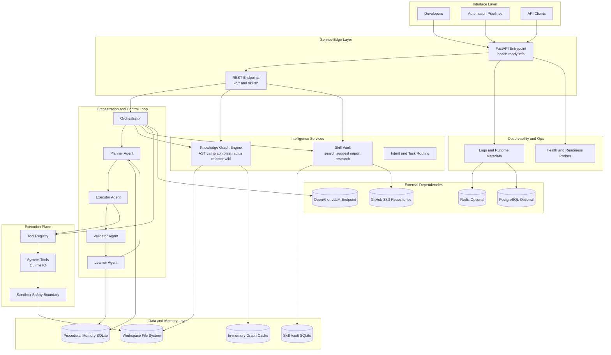

# Nexus-Agent Advanced System Architecture and Usage Guide

This guide provides:

- An advanced architecture view of Nexus-Agent runtime and data flow.
- A practical operations manual for local, containerized, and iterative agent workflows.
- Recommended execution patterns for safe refactor, skill learning, and autonomous planning.

## 1. Advanced System Architecture Diagram



## 2. Runtime Control Loop

Nexus-Agent uses a task-oriented loop:

1. Planner decomposes goal into executable steps.
2. Executor applies tools and workspace actions.
3. Validator evaluates results and quality signals.
4. Learner stores reusable patterns for future tasks.
5. Control returns to Planner when iteration is needed.

This loop enables gradual convergence instead of one-pass generation.

## 3. Usage Manual

## 3.1 Prerequisites

- Python 3.10+
- pip
- Optional Docker and Docker Compose
- Optional git binary for remote skill import

## 3.2 Environment Setup

```powershell
python -m venv .venv
.\.venv\Scripts\Activate.ps1
python -m pip install --upgrade pip setuptools wheel
pip install -r requirements.txt
pip install -e ".[dev]"
```

Optional orchestration model integration:

```powershell
pip install langchain-openai
```

## 3.3 Start Service

```powershell
uvicorn nexus_agent.entrypoint:app --host 0.0.0.0 --port 8080 --reload
```

Verify service state:

```powershell
curl http://localhost:8080/health
curl http://localhost:8080/ready
curl http://localhost:8080/info
```

## 3.4 Knowledge Graph Workflow

1. Build graph cache.

```powershell
curl -X POST http://localhost:8080/kg/build -H "Content-Type: application/json" -d "{}"
```

1. Trace a call flow from entry symbol.

```powershell
curl -X POST http://localhost:8080/kg/trace -H "Content-Type: application/json" -d '{"entry_symbol":"app.main","max_depth":6}'
```

1. Evaluate blast radius before edits.

```powershell
curl -X POST http://localhost:8080/kg/blast-radius -H "Content-Type: application/json" -d '{"changed_symbols":["service.run_service"],"depth":2}'
```

1. Plan synchronized refactor.

```powershell
curl -X POST http://localhost:8080/kg/refactor -H "Content-Type: application/json" -d '{"rename_map":{"old_name":"new_name"},"apply_changes":false}'
```

1. Generate graph-driven wiki.

```powershell
curl -X POST http://localhost:8080/kg/wiki -H "Content-Type: application/json" -d '{"output_dir":"docs/graph-wiki"}'
```

## 3.5 Skill Vault Workflow

1. Add or update a skill.

```powershell
curl -X POST http://localhost:8080/skills/add -H "Content-Type: application/json" -d '{"name":"Blast Radius Analysis","summary":"Analyze impact before editing","description_md":"Use dependency and call graph","tags":["graph","refactor"]}'
```

1. Import skills from local markdown directory.

```powershell
curl -X POST http://localhost:8080/skills/import -H "Content-Type: application/json" -d '{"directory":"C:/path/to/skills","source":"awesome-codex-skills"}'
```

1. Import skills directly from GitHub (clone or pull).

```powershell
curl -X POST http://localhost:8080/skills/import-github -H "Content-Type: application/json" -d '{"repo_url":"https://github.com/owner/awesome-codex-skills.git","branch":"main","source":"awesome-codex-skills"}'
```

1. Search and suggest reusable skills.

```powershell
curl -X POST http://localhost:8080/skills/search -H "Content-Type: application/json" -d '{"query":"blast radius refactor","top_k":5}'
curl -X POST http://localhost:8080/skills/suggest -H "Content-Type: application/json" -d '{"query":"safe refactor workflow","top_k":5}'
```

1. Record execution outcomes for maturity evolution.

```powershell
curl -X POST http://localhost:8080/skills/execution -H "Content-Type: application/json" -d '{"skill_ref":"Refactor Safety","successful":true,"feedback":"Validated in integration run"}'
```

1. Generate deep research and autonomous task plan.

```powershell
curl -X POST http://localhost:8080/skills/research -H "Content-Type: application/json" -d '{"topic":"safe multi-file refactor strategy","top_k":5,"include_repo_signals":true}'
curl -X POST http://localhost:8080/skills/autonomous-plan -H "Content-Type: application/json" -d '{"task_text":"analyze blast radius and refactor safely","top_k":5}'
```

## 4. Recommended Advanced Operating Pattern

Use this order for high-safety engineering tasks:

1. Build graph.
1. Trace execution path from target entrypoint.
1. Run blast radius for proposed symbol changes.
1. Prepare refactor plan in dry-run mode.
1. Apply only after validation checkpoints.
1. Record outcomes in Skill Vault for future automation.

## 5. Production Topology Guidance

- Run API as stateless container replicas.
- Persist skill and playbook SQLite files on mounted durable volumes.
- Route model traffic to managed OpenAI or internal vLLM endpoint.
- Add reverse proxy, auth, and rate limiting for external API exposure.
- Export health and readiness probes into orchestrator platform checks.

## 6. Troubleshooting Quick Reference

- Import from GitHub fails with git missing:
  Install git and ensure it is available on PATH.
- /kg/trace or /kg/blast-radius returns missing graph context:
  Build graph first using /kg/build for the same repository root.
- No skills returned for suggestion:
  Seed initial skills via /skills/add or /skills/import before suggesting.
- Skill import succeeds but expected tags are absent:
  Provide default_tags in request payload and verify markdown directory layout.
