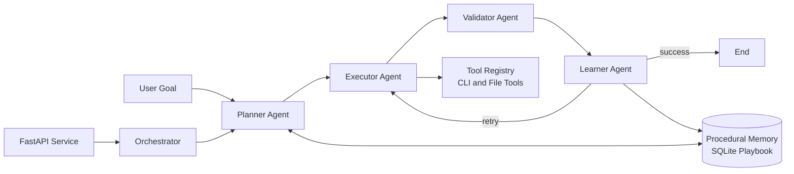

# Nexus-Agent

Nexus-Agent is a task-oriented Multi-AI Agent orchestration project for planning, implementing, validating, and continuously improving software tasks.

The repository includes:

- A FastAPI runtime entrypoint for container deployment and operational health endpoints.
- Structured agent contracts using Pydantic models.
- Multi-agent role implementations (architect, developer, optimizer).
- An experimental LangGraph control loop with automatic skill learning backed by SQLite.
- A production-hardening layer: API-key auth, slowapi rate limiting, security headers, Prometheus metrics, Sentry, circuit breakers, Alembic migrations, and PDPA audit logging.
- React 19 dashboard with API-key login, Thai/English i18n, ErrorBoundary, and strict CSP.
- Docker, Docker Compose, and Portainer-ready deployment assets.

## Current Status

- Production-oriented service shell is available via FastAPI in [nexus_agent/entrypoint.py](nexus_agent/entrypoint.py).
- Core models and agent classes are implemented and tested in [nexus_agent/core/models.py](nexus_agent/core/models.py) and [nexus_agent/agents](nexus_agent/agents).
- LangGraph planner-executor-validator-learner orchestration exists in [nexus_agent/core/orchestrator.py](nexus_agent/core/orchestrator.py) and is under active iteration.
- AST-based Knowledge Graph Engine is implemented in [nexus_agent/core/knowledge_graph_engine.py](nexus_agent/core/knowledge_graph_engine.py).
- Persistent Skill Vault and Local Deep Research engine are implemented in [nexus_agent/core/skill_vault.py](nexus_agent/core/skill_vault.py).
- Centralised configuration via [nexus_agent/core/settings.py](nexus_agent/core/settings.py); auth, rate limit, metrics, retries, circuit breakers, Postgres pool and Sentry are all env-driven.
- Containerized deployment is ready using [Dockerfile](Dockerfile), [docker-compose.yml](docker-compose.yml), [Stack.env](Stack.env), and [docker/entrypoint.sh](docker/entrypoint.sh) (runs `alembic upgrade head` automatically).

## Production Hardening (v0.3)

The `v0.3` series turns Nexus-Agent into a production-deployable service for the Cyber-Thai Command Center. All modules listed below ship in the default container image and are driven by [Stack.env](Stack.env).

- **Security** — [security.py](nexus_agent/core/security.py), [middleware.py](nexus_agent/core/middleware.py): two-tier API-key auth (`X-API-Key`), WebSocket `?token=`, security headers, request-id propagation, JSON access logs.
- **Rate limiting** — [rate_limit.py](nexus_agent/core/rate_limit.py): slowapi keyed by API key (IP fallback), Redis-backed when `REDIS_URL` is set.
- **Configuration** — [settings.py](nexus_agent/core/settings.py): `pydantic-settings` single source of truth + `@lru_cache`.
- **Data layer** — [database.py](nexus_agent/core/database.py), [db_models.py](nexus_agent/core/db_models.py), [alembic/](alembic/): SQLAlchemy 2.0 + Alembic migrations, audit log + LLM cost tables, SQLite fallback for dev.
- **Cache / pub-sub** — [redis_client.py](nexus_agent/core/redis_client.py): pooled `redis` client + `ping_redis()` for readiness.
- **Observability** — [metrics.py](nexus_agent/core/metrics.py), [cost.py](nexus_agent/core/cost.py), [sentry_init.py](nexus_agent/core/sentry_init.py), [logging_config.py](nexus_agent/core/logging_config.py): Prometheus `/metrics`, per-provider tokens + USD cost, optional Sentry (PII-off), structured JSON logs.
- **Reliability** — [resilience.py](nexus_agent/core/resilience.py): `tenacity` retries + per-provider `pybreaker` circuit breaker wrapping every LLM call.
- **Compliance** — [audit.py](nexus_agent/core/audit.py), [docs/secrets.md](docs/secrets.md), [SECURITY.md](SECURITY.md): PDPA-friendly audit log writer; documented secrets + rotation policy.
- **Frontend** — [App.tsx](frontend/src/App.tsx), [auth.tsx](frontend/src/auth.tsx), [i18n.tsx](frontend/src/i18n.tsx), [ErrorBoundary.tsx](frontend/src/components/ErrorBoundary.tsx): login gate, TH/EN i18n, error boundary, strict CSP in [nginx.conf](frontend/nginx.conf), WS token auto-inject.
- **Supply chain** — [dependabot.yml](.github/dependabot.yml), [codeql.yml](.github/workflows/codeql.yml): weekly Dependabot + CodeQL scans.
- **Ops** — [runbook.md](docs/runbook.md), [ADR-0001](docs/adr/0001-architecture-baseline.md), [k6 load test](tests/load/k6_inference.js).

Set `NEXUS_API_KEYS` (CSV) to enable auth; leave empty for local development. Every protected route returns `401` until at least one key is provided, and admin-only routes additionally require `NEXUS_ADMIN_API_KEYS`.

## New Engines (v0.2)

The repository now includes two major capability layers inspired by GitNexus, awesome-codex-skills, and OpenAGI style workflows:

1. Knowledge Graph Engine
1. Persistent Skill Vault

### Knowledge Graph Engine

- Convert repository into AST graph.
- See function calls and dependency links across files.
- Trace execution flow from selected entry symbol.
- Analyze blast radius before code changes.
- Plan synchronized cross-file refactor (identifier rename).
- Generate automatic wiki pages from graph metadata.

### Persistent Skill Vault

- Store skills in persistent SQLite memory with maturity scoring.
- Import markdown skills (for example from awesome-codex-skills style repositories).
- Search or suggest skills by task intent.
- Record execution feedback and evolve skill quality.
- Run local deep research with optional repository graph signals.
- Generate autonomous human-like task plans from skill memory and rules.

## High-Level Architecture



## Advanced Architecture and Usage Guide

For a complete advanced architecture diagram and step-by-step operations manual, see:

- [Advanced System Architecture and Usage Guide](docs/Advanced-System-Architecture-and-Usage-Guide.md)
- [คู่มือสถาปัตยกรรมระบบขั้นสูงและวิธีใช้งาน (ภาษาไทย)](docs/Advanced-System-Architecture-and-Usage-Guide.th.md)
- [Executive One-Page Brief (TH)](docs/Executive-One-Page-Architecture-Value-Rollout.th.md)
- [Advanced Architecture Diagram (SVG)](docs/advanced-system-architecture-diagram.svg)
- [Advanced Architecture Diagram (PNG)](docs/advanced-system-architecture-diagram.png)

## Repository Layout

```text
.
|- nexus_agent/
|  |- agents/         # Agent role implementations
|  |- core/           # Orchestration, memory, state, gateway, runtime modules
|  |               (settings, security, middleware, rate_limit, metrics, cost,
|  |                resilience, database, redis_client, db_models, audit, ...)
|  |- prompts/        # Prompt templates
|  |- tools/          # Tool registry and system tools
|  |- utils/          # Utility functions (diff utilities, etc.)
|- alembic/           # SQLAlchemy schema migrations (applied at container start)
|- docker/            # entrypoint.sh (runs `alembic upgrade head` on boot)
|- docs/              # Architecture, runbook, ADRs, secrets policy
|- frontend/          # React 19 + Vite dashboard (Cyber-Thai Command Center)
|- tests/             # Unit tests + tests/load/ (k6)
|- .github/           # CI/CD, Dependabot, CodeQL workflows
|- Dockerfile         # Multi-stage production image
|- docker-compose.yml # Local and Portainer stack definition
|- Stack.env          # Environment variable template
|- SECURITY.md        # Vulnerability disclosure policy
|- start_vllm.bat     # Optional local vLLM server launcher
```

## Requirements

- Python 3.10–3.12 (Python 3.14 free-threaded build is not yet supported)
- pip (or [`uv`](https://docs.astral.sh/uv/) for fast venvs)
- Docker and Docker Compose (optional, for container deployment)
- PostgreSQL 14+ and Redis 7+ in production (SQLite is used automatically when `DATABASE_URL` is empty)

## Quick Start (Local Development)

1. Create and activate a virtual environment.

```powershell
python -m venv .venv
.\.venv\Scripts\Activate.ps1
```

1. Install dependencies.

```powershell
python -m pip install --upgrade pip setuptools wheel
pip install -r requirements.txt
pip install -e ".[dev]"
```

1. Optional: install experimental orchestration runtime dependency for planner and learner modules.

```powershell
pip install langchain-openai
```

1. Apply database migrations (uses SQLite by default when `DATABASE_URL` is empty).

```powershell
$env:DATABASE_URL = "sqlite:///./nexus_local.db"   # or your Postgres DSN
alembic upgrade head
```

1. Run the API service.

```powershell
uvicorn nexus_agent.entrypoint:app --host 0.0.0.0 --port 8080 --reload
```

1. Verify service endpoints.

```powershell
curl http://localhost:8080/
curl http://localhost:8080/health
curl http://localhost:8080/ready
curl http://localhost:8080/info
```

## API Endpoints

| Endpoint | Purpose | Notes |
| --- | --- | --- |
| / | Service metadata and endpoint discovery | Always enabled |
| /health | Liveness probe | Returns service uptime and version |
| /ready | Readiness probe | Reports configured dependencies from env vars |
| /info | Runtime and configuration metadata | Includes Python version and selected env config |
| /kg/build | Build repository AST graph | Caches graph for trace and blast-radius endpoints |
| /kg/trace | Trace execution flow | Requires built graph |
| /kg/blast-radius | Analyze impact scope | Requires built graph |
| /kg/refactor | Plan or apply synchronized refactor | Identifier-level rename across files |
| /kg/wiki | Generate graph-driven wiki | Writes markdown pages to output directory |
| /skills/add | Add or update one skill | Persistent storage in SQLite |
| /skills/import | Import markdown skill library | Useful for awesome-codex-skills style content |
| /skills/import-github | Import skills from GitHub/local git source | Auto sync then ingest markdown skills |
| /skills/search | Search skills | Full-text + tags |
| /skills/suggest | Suggest skills for a task | Relevance-ranked |
| /skills/execution | Record execution feedback | Updates maturity and success metrics |
| /skills/research | Local deep research | Uses skills plus optional graph signals |
| /skills/autonomous-plan | Generate autonomous task plan | Human-like planning pattern |
| /inference/providers | List active LLM providers | OpenAI / Claude / Gemini / vLLM / Ollama / Azure |
| /inference/generate | Chat completion across the provider chain | Optional `provider` field to pin |
| /dashboard/snapshot | Per-agent runtime state snapshot | For Cyber-Thai Command Center hydration |
| /dashboard/metrics | Per-agent metrics + GPU stats | Aggregated by `ObservabilityManager` |
| /dashboard/emit | Manually push an agent-state event | Useful for demos / external integrations |
| /ws/dashboard | WebSocket stream of real-time agent events | Consumed by the React dashboard (requires `?token=` when auth is enabled) |
| /metrics | Prometheus metrics exposition | Enabled when `METRICS_ENABLED=true` (default) |
| /docs | OpenAPI docs | Enabled only when ENVIRONMENT is not production |
| /redoc | ReDoc docs | Enabled only when ENVIRONMENT is not production |

### Authentication & rate limits

- All `/inference/*` and `/dashboard/emit` routes require `X-API-Key: <viewer-or-admin-key>` when `NEXUS_API_KEYS` is configured.
- `/dashboard/emit` additionally requires an admin key (`NEXUS_ADMIN_API_KEYS`).
- WebSocket clients must include `?token=<api-key>` (the frontend does this automatically using the key from `localStorage`).
- Default limits: `60/minute` per key, `20/minute` for `/inference/generate`. Tune via `RATE_LIMIT_DEFAULT` and `RATE_LIMIT_INFERENCE`.

## Cyber-Thai Command Center (Dashboard)

A real-time React 19 + Tailwind dashboard ships in [frontend/](frontend/).
It streams events from `/ws/dashboard` and renders six Cyber-Thai avatars
(planner · architect · developer · ui_weaver · validator · optimizer) with
micro-state animations, EXP gamification, and a live log ticker.

```powershell
# 1. Start the backend
uvicorn nexus_agent.entrypoint:app --reload --port 8080

# 2. Start the dashboard
cd frontend
npm install
npm run dev   # http://localhost:5173
```

See [frontend/README.md](frontend/README.md) for full details and the avatar
roster description.

## Multi-Provider LLM Support

The inference layer in [nexus_agent/core/inference.py](nexus_agent/core/inference.py)
supports a configurable **fallback chain** across multiple providers:

| Provider type     | Models                                     | Env vars                                                 |
| ----------------- | ------------------------------------------ | -------------------------------------------------------- |
| openai_compatible | OpenAI / Azure / vLLM / Ollama / LM Studio | `OPENAI_API_KEY`, `OPENAI_BASE_URL`, `OPENAI_MODEL`      |
| anthropic         | Claude 3.x                                 | `ANTHROPIC_API_KEY`, `ANTHROPIC_MODEL`                   |
| gemini            | Gemini 1.5 Pro / Flash                     | `GEMINI_API_KEY`, `GEMINI_MODEL`                         |
| vllm (local)      | Any HF chat model                          | `VLLM_ENABLED=true`, `VLLM_BASE_URL`, `VLLM_MODEL_NAME`  |

Whatever env vars you set are auto-detected; you may also pass a
`providers=[ProviderConfig(...)]` list explicitly to `InferenceEngine`. The
engine tries providers in order until one succeeds, and per-call token usage is
fed into the per-agent metrics registry for cost dashboards.

## Example Workflows

Build graph:

```powershell
curl -X POST http://localhost:8080/kg/build -H "Content-Type: application/json" -d "{}"
```

Trace execution flow:

```powershell
curl -X POST http://localhost:8080/kg/trace -H "Content-Type: application/json" -d '{"entry_symbol":"nexus_agent.core.orchestrator.Orchestrator.run_task","max_depth":6}'
```

Blast radius before edit:

```powershell
curl -X POST http://localhost:8080/kg/blast-radius -H "Content-Type: application/json" -d '{"changed_symbols":["nexus_agent.core.memory.ProceduralMemory.add_rule"],"depth":2}'
```

Plan synchronized refactor:

```powershell
curl -X POST http://localhost:8080/kg/refactor -H "Content-Type: application/json" -d '{"rename_map":{"old_name":"new_name"},"apply_changes":false}'
```

Generate wiki:

```powershell
curl -X POST http://localhost:8080/kg/wiki -H "Content-Type: application/json" -d '{"output_dir":"docs/graph-wiki"}'
```

Add and search skills:

```powershell
curl -X POST http://localhost:8080/skills/add -H "Content-Type: application/json" -d '{"name":"Blast Radius Analysis","summary":"Analyze impact before edit","description_md":"Use graph before refactor","tags":["graph","refactor"]}'
curl -X POST http://localhost:8080/skills/search -H "Content-Type: application/json" -d '{"query":"blast radius for refactor","top_k":5}'
```

Run local deep research:

```powershell
curl -X POST http://localhost:8080/skills/research -H "Content-Type: application/json" -d '{"topic":"safe multi-file refactor strategy","top_k":5,"include_repo_signals":true}'
```

Generate autonomous plan:

```powershell
curl -X POST http://localhost:8080/skills/autonomous-plan -H "Content-Type: application/json" -d '{"task_text":"analyze blast radius and refactor safely","top_k":5}'
```

## Import External Skill Libraries

To import a local clone of a markdown-based skill repository:

```powershell
curl -X POST http://localhost:8080/skills/import -H "Content-Type: application/json" -d '{"directory":"C:/path/to/awesome-codex-skills","source":"awesome-codex-skills"}'
```

To import directly from GitHub (clone or pull automatically):

```powershell
curl -X POST http://localhost:8080/skills/import-github -H "Content-Type: application/json" -d '{"repo_url":"https://github.com/owner/awesome-codex-skills.git","branch":"main","source":"awesome-codex-skills"}'
```

This allows Nexus-Agent to keep a persistent, evolving skill memory for Local Deep Research and autonomous planning.

## Run Tests

```powershell
python -m pytest -v --tb=short
```

## Docker (Single Container)

Build image:

```powershell
docker build -t nexus-agent:latest .
```

Run container:

```powershell
docker run --rm -p 8080:8080 --env-file Stack.env nexus-agent:latest
```

## Docker Compose and Portainer Stack

Start the full stack (API + Redis + PostgreSQL):

```powershell
docker compose --env-file Stack.env up -d
```

Common operations:

```powershell
docker compose ps
docker compose logs -f nexus-agent
docker compose down
```

The same [docker-compose.yml](docker-compose.yml) and [Stack.env](Stack.env) files can be used in Portainer Stacks.

## Environment Configuration

Main variables are defined in [Stack.env](Stack.env). Important settings include:

- **Application**: `ENVIRONMENT`, `APP_VERSION`, `NEXUS_PORT`, `LOG_LEVEL`, `WEB_CONCURRENCY`
- **Security**: `NEXUS_AUTH_REQUIRED`, `NEXUS_API_KEYS`, `NEXUS_ADMIN_API_KEYS`, `NEXUS_WS_TOKEN`, `CORS_ORIGINS`
- **Rate limiting**: `RATE_LIMIT_ENABLED`, `RATE_LIMIT_DEFAULT`, `RATE_LIMIT_INFERENCE`
- **Observability**: `JSON_LOGS`, `METRICS_ENABLED`, `SENTRY_DSN`, `SENTRY_TRACES_SAMPLE_RATE`
- **Reliability**: `INFERENCE_TIMEOUT_SECONDS`, `INFERENCE_MAX_RETRIES`, `CIRCUIT_BREAKER_THRESHOLD`, `CIRCUIT_BREAKER_RESET_SECONDS`
- **Model provider**: `OPENAI_API_KEY`, `OPENAI_BASE_URL`, `OPENAI_MODEL`, `ANTHROPIC_API_KEY`, `GEMINI_API_KEY`
- **Optional local inference**: `VLLM_ENABLED`, `VLLM_MODEL_NAME`, `VLLM_HOST`, `VLLM_PORT`
- **Data services**: `DATABASE_URL`, `REDIS_URL`, `DB_POOL_SIZE`, `DB_MAX_OVERFLOW`, `REDIS_PASSWORD`, `POSTGRES_USER`, `POSTGRES_PASSWORD`, `POSTGRES_DB`

See [docs/secrets.md](docs/secrets.md) for the supported secrets backends and rotation policy.

To enable interactive API docs locally:

- Set `ENVIRONMENT=development`
- Restart the service
- Open `/docs` or `/redoc`

## Optional: Run Local vLLM

If you want OpenAI-compatible local inference, use [start_vllm.bat](start_vllm.bat):

```powershell
start_vllm.bat
```

Then point the application to your local endpoint:

- OPENAI_BASE_URL=<http://localhost:8000/v1>
- OPENAI_MODEL=<your_model_name>

## CI/CD

GitHub Actions workflows:

1. [ci-cd.yml](.github/workflows/ci-cd.yml) — lint, test, coverage, Docker build/push to GHCR, Portainer webhook deployment.
1. [codeql.yml](.github/workflows/codeql.yml) — weekly security scan (Python + JavaScript/TypeScript) with `security-and-quality` queries.
1. [dependabot.yml](.github/dependabot.yml) — weekly grouped updates for pip, npm (root + `/frontend`), Docker, and GitHub Actions.

Load-test the deployed instance with k6:

```powershell
k6 run -e API_BASE=http://localhost:5190 -e API_KEY=$env:NEXUS_API_KEY tests/load/k6_inference.js
```

## Project Documentation

- [Operations Runbook](docs/runbook.md)
- [ADR 0001 — Production Architecture Baseline](docs/adr/0001-architecture-baseline.md)
- [Secrets Management Policy](docs/secrets.md)
- [Security Disclosure Policy](SECURITY.md)
- [Automatic Skill Learning and Repository Implementation](docs/Automatic%20Skill%20Learning%20%26%20Repository%20Implementation.md)
- [Advanced System Architecture and Usage Guide](docs/Advanced-System-Architecture-and-Usage-Guide.md)
- [คู่มือสถาปัตยกรรมระบบขั้นสูงและวิธีใช้งาน (ภาษาไทย)](docs/Advanced-System-Architecture-and-Usage-Guide.th.md)
- [Executive One-Page Brief (TH)](docs/Executive-One-Page-Architecture-Value-Rollout.th.md)
- [Evolving Nexus-Agent into a Task-Oriented Multi-Agent System](docs/Evolving%20Nexus-Agent%20into%20a%20Task-Oriented%20Multi-Agent%20System.md)
- [Nexus-Agent Automatic Skill Learning Implementation](docs/Nexus-Agent%20Automatic%20Skill%20Learning%20Implementation.md)
- [Nexus-Agent Migration Walkthrough](docs/Nexus-Agent%20Migration%20Walkthrough.md)
- [Nexus-Agent System Implementation Walkthrough](docs/Nexus-Agent%20System%20Implementation%20Walkthrough.md)
- [Nexus-Agent Multi-AI Agent System Documentation](docs/Nexus-Agent_%20Multi-AI%20Agent%20System%20Documentation.md)
- [Nexus-Agent HTML Documentation](docs/Nexus-Agent-Documentation.html)

## Contributing

1. Create a feature branch from main.
1. Make changes with tests.
1. Run local checks and test suite.
1. Open a pull request.

## License

No license file is currently present in this repository.
