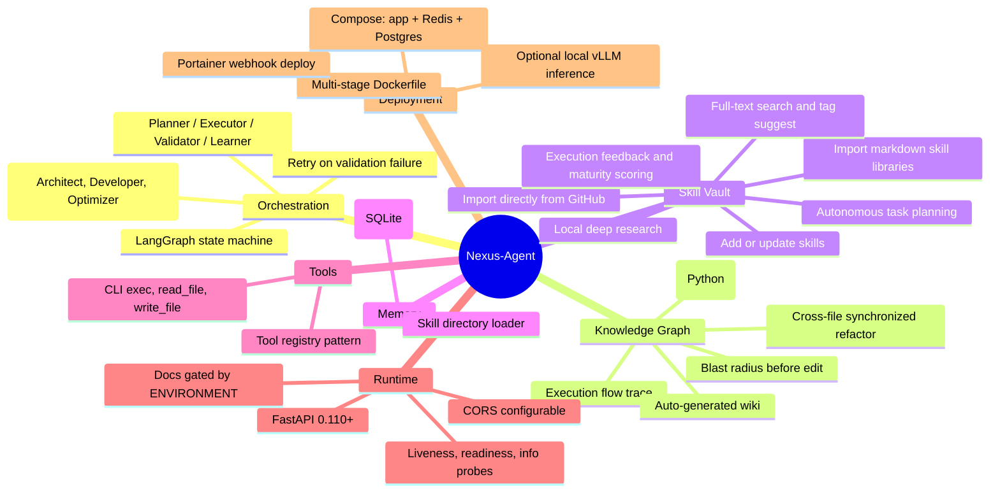
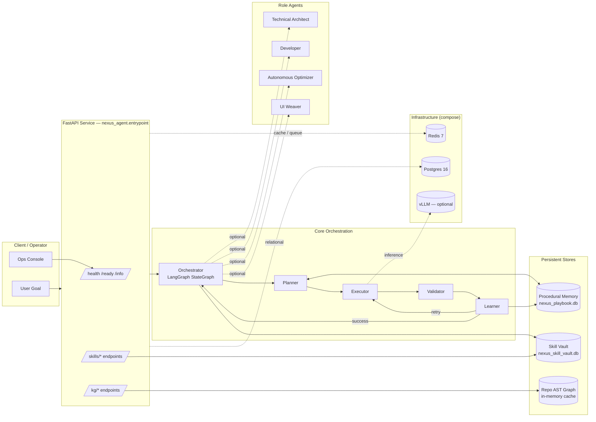
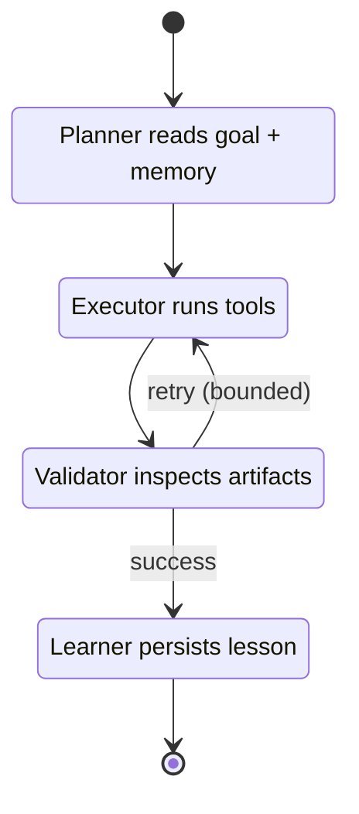
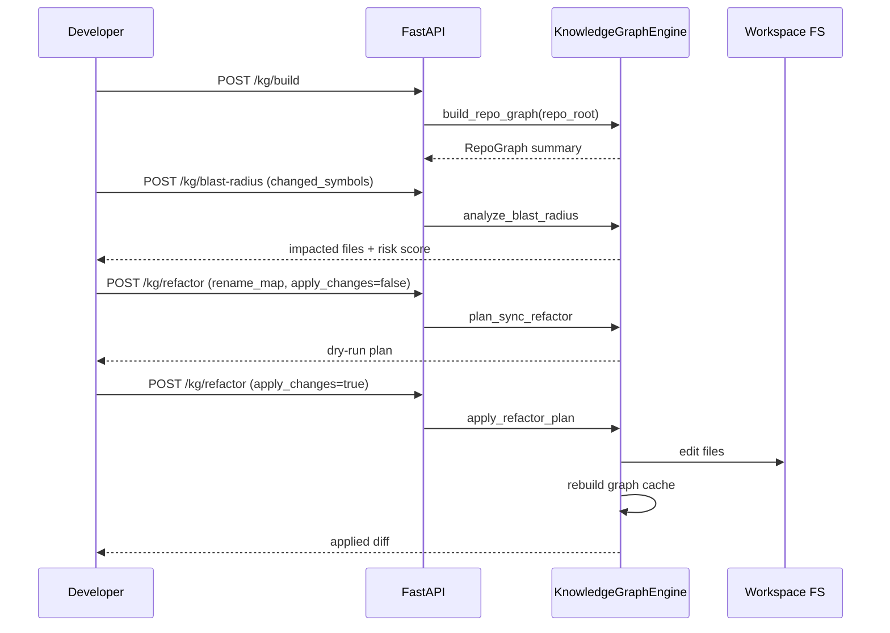
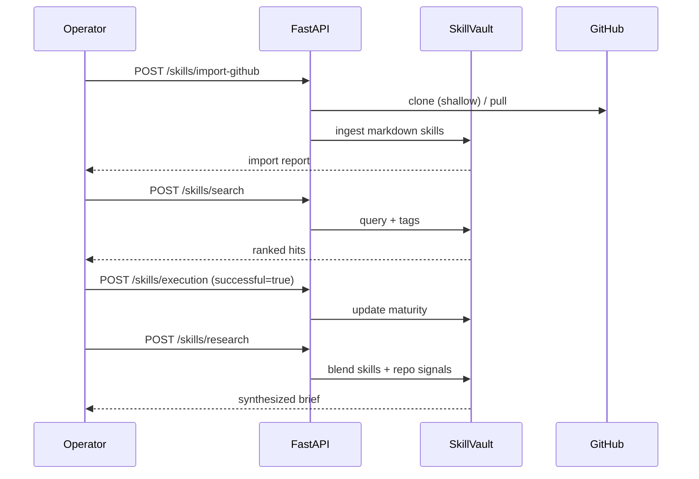
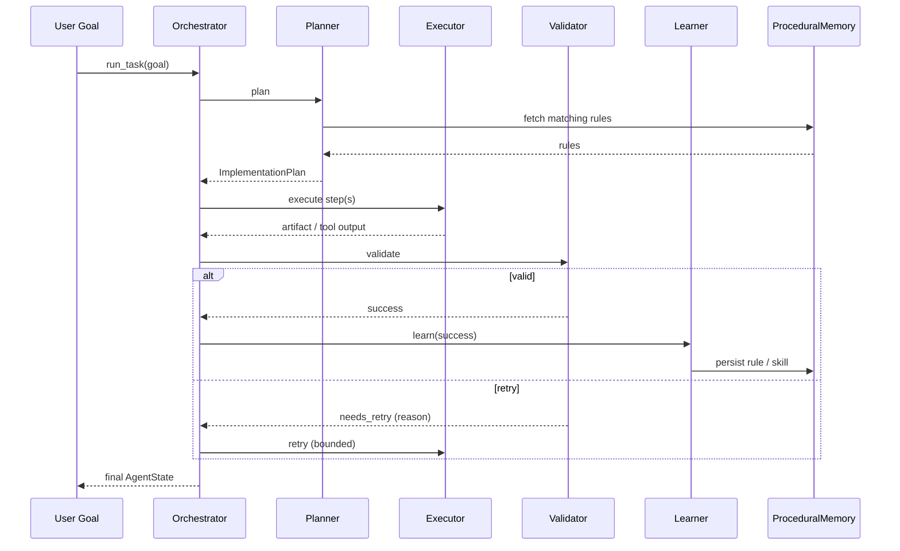

<!-- markdownlint-disable MD033 MD041 MD036 MD051 -->
<div align="center">

# Nexus-Agent

**Task-Oriented Multi-AI Agent Orchestration Platform**
*Plan · Implement · Validate · Learn — continuously, autonomously, observably.*

[](https://www.python.org/)
[](https://fastapi.tiangolo.com/)
[](https://github.com/langchain-ai/langgraph)
[](https://docs.pydantic.dev/)
[](https://docs.docker.com/compose/)
[](#license)
[](#roadmap)

<<<<<<< Updated upstream
- A FastAPI runtime entrypoint for container deployment and operational health endpoints.
- Structured agent contracts using Pydantic models.
- Multi-agent role implementations (architect, developer, optimizer).
- An experimental LangGraph control loop with automatic skill learning backed by SQLite.
- A production-hardening layer: API-key auth, slowapi rate limiting, security headers, Prometheus metrics, Sentry, circuit breakers, Alembic migrations, and PDPA audit logging.
- React 19 dashboard with API-key login, Thai/English i18n, ErrorBoundary, and strict CSP.
- Docker, Docker Compose, and Portainer-ready deployment assets.
=======
</div>
>>>>>>> Stashed changes

---

<<<<<<< Updated upstream
- Production-oriented service shell is available via FastAPI in [nexus_agent/entrypoint.py](nexus_agent/entrypoint.py).
- Core models and agent classes are implemented and tested in [nexus_agent/core/models.py](nexus_agent/core/models.py) and [nexus_agent/agents](nexus_agent/agents).
- LangGraph planner-executor-validator-learner orchestration exists in [nexus_agent/core/orchestrator.py](nexus_agent/core/orchestrator.py) and is under active iteration.
- AST-based Knowledge Graph Engine is implemented in [nexus_agent/core/knowledge_graph_engine.py](nexus_agent/core/knowledge_graph_engine.py).
- Persistent Skill Vault and Local Deep Research engine are implemented in [nexus_agent/core/skill_vault.py](nexus_agent/core/skill_vault.py).
- Centralised configuration via [nexus_agent/core/settings.py](nexus_agent/core/settings.py); auth, rate limit, metrics, retries, circuit breakers, Postgres pool and Sentry are all env-driven.
- Containerized deployment is ready using [Dockerfile](Dockerfile), [docker-compose.yml](docker-compose.yml), [Stack.env](Stack.env), and [docker/entrypoint.sh](docker/entrypoint.sh) (runs `alembic upgrade head` automatically).

## Production Hardening (v0.3)

The `v0.3` series turns Nexus-Agent into a production-deployable service for the Cyber-Thai Command Center. All modules listed below ship in the default container image and are driven by [Stack.env](Stack.env).

- **Security** — [security.py](nexus_agent/core/security.py), [middleware.py](nexus_agent/core/middleware.py): two-tier API-key auth (`X-API-Key`), WebSocket `?token=`, security headers, request-id propagation, JSON access logs.
- **Rate limiting** — [rate_limit.py](nexus_agent/core/rate_limit.py): slowapi keyed by API key (IP fallback), Redis-backed when `REDIS_URL` is set.
- **Configuration** — [settings.py](nexus_agent/core/settings.py): `pydantic-settings` single source of truth + `@lru_cache`.
- **Data layer** — [database.py](nexus_agent/core/database.py), [db_models.py](nexus_agent/core/db_models.py), [alembic/](alembic/): SQLAlchemy 2.0 + Alembic migrations, audit log + LLM cost tables, SQLite fallback for dev.
- **Cache / pub-sub** — [redis_client.py](nexus_agent/core/redis_client.py): pooled `redis` client + `ping_redis()` for readiness.
- **Observability** — [metrics.py](nexus_agent/core/metrics.py), [cost.py](nexus_agent/core/cost.py), [sentry_init.py](nexus_agent/core/sentry_init.py), [logging_config.py](nexus_agent/core/logging_config.py): Prometheus `/metrics`, per-provider tokens + USD cost, optional Sentry (PII-off), structured JSON logs.
- **Reliability** — [resilience.py](nexus_agent/core/resilience.py): `tenacity` retries + per-provider `pybreaker` circuit breaker wrapping every LLM call.
- **Compliance** — [audit.py](nexus_agent/core/audit.py), [docs/secrets.md](docs/secrets.md), [SECURITY.md](SECURITY.md): PDPA-friendly audit log writer; documented secrets + rotation policy.
- **Frontend** — [App.tsx](frontend/src/App.tsx), [auth.tsx](frontend/src/auth.tsx), [i18n.tsx](frontend/src/i18n.tsx), [ErrorBoundary.tsx](frontend/src/components/ErrorBoundary.tsx): login gate, TH/EN i18n, error boundary, strict CSP in [nginx.conf](frontend/nginx.conf), WS token auto-inject.
- **Supply chain** — [dependabot.yml](.github/dependabot.yml), [codeql.yml](.github/workflows/codeql.yml): weekly Dependabot + CodeQL scans.
- **Ops** — [runbook.md](docs/runbook.md), [ADR-0001](docs/adr/0001-architecture-baseline.md), [k6 load test](tests/load/k6_inference.js).

Set `NEXUS_API_KEYS` (CSV) to enable auth; leave empty for local development. Every protected route returns `401` until at least one key is provided, and admin-only routes additionally require `NEXUS_ADMIN_API_KEYS`.
=======
## Table of Contents
>>>>>>> Stashed changes

- [Nexus-Agent](#nexus-agent)
  - [Table of Contents](#table-of-contents)
  - [1. Executive Summary](#1-executive-summary)
  - [2. Capability Map](#2-capability-map)
  - [3. High-Level Architecture](#3-high-level-architecture)
  - [4. Agent Roles \& Control Loop](#4-agent-roles--control-loop)
    - [4.1 Control Loop (Observe → Reason → Decide → Act → Learn)](#41-control-loop-observe--reason--decide--act--learn)
    - [4.2 Role Catalogue](#42-role-catalogue)
  - [5. Repository Layout](#5-repository-layout)
  - [6. Quick Start](#6-quick-start)
    - [6.1 Prerequisites](#61-prerequisites)
    - [6.2 Local Bootstrap (Windows / PowerShell)](#62-local-bootstrap-windows--powershell)
    - [6.3 Using uv (faster, isolated)](#63-using-uv-faster-isolated)
  - [7. Configuration Reference](#7-configuration-reference)
  - [8. API Reference](#8-api-reference)
    - [8.1 Operations](#81-operations)
    - [8.2 Knowledge Graph](#82-knowledge-graph)
    - [8.3 Skill Vault](#83-skill-vault)
  - [9. End-to-End Workflows](#9-end-to-end-workflows)
    - [9.1 Safe Refactor (Knowledge Graph)](#91-safe-refactor-knowledge-graph)
    - [9.2 Skill Lifecycle (Vault)](#92-skill-lifecycle-vault)
    - [9.3 Agentic Task Run (Orchestrator)](#93-agentic-task-run-orchestrator)
  - [10. Persistent Stores \& Data Model](#10-persistent-stores--data-model)
  - [11. Deployment](#11-deployment)
    - [11.1 Single-Container (Docker)](#111-single-container-docker)
    - [11.2 Compose Stack (App + Redis + Postgres)](#112-compose-stack-app--redis--postgres)
    - [11.3 Portainer Stack](#113-portainer-stack)
    - [11.4 Local LLM (vLLM) — Optional](#114-local-llm-vllm--optional)
  - [12. Testing \& Quality Gates](#12-testing--quality-gates)
  - [13. Operational Runbook](#13-operational-runbook)
  - [14. Roadmap](#14-roadmap)
  - [15. Documentation Index](#15-documentation-index)
  - [16. Contributing](#16-contributing)
  - [17. License](#17-license)

---

## 1. Executive Summary

Nexus-Agent คือระบบ **Multi-AI Agent Orchestration** ที่ออกแบบให้รับเป้าหมายภาษาธรรมชาติแล้วเดินผ่านวงจร **Observe → Reason → Decide → Act → Learn** อย่างต่อเนื่อง โดยใช้ LangGraph เป็น control-plane และ FastAPI เป็น service surface พร้อม Knowledge Graph Engine และ Persistent Skill Vault สำหรับการสะสมความรู้ระดับองค์กร

| Pillar | What it Delivers | Surface |
| --- | --- | --- |
| **Agentic Control Loop** | Planner → Executor → Validator → Learner with retry policy | `nexus_agent/core/orchestrator.py` |
| **Role-Based Agents** | Architect, Developer, Optimizer, UI Weaver, Learner | `nexus_agent/agents/*` |
| **Knowledge Graph Engine** | AST-level call graph, trace flow, blast-radius, sync refactor, auto wiki | `/kg/*` endpoints |
| **Persistent Skill Vault** | SQLite-backed skills with maturity scoring, import, search, deep research | `/skills/*` endpoints |
| **Procedural Memory** | Reusable playbooks & rules surfaced by the Planner | `nexus_agent/core/memory.py` |
| **Container-Ready Runtime** | FastAPI + Redis + Postgres compose stack, Portainer webhook deploy | `docker-compose.yml`, `Stack.env` |

> **Design intent.** Treat every task as an experiment: the agent plans, runs, validates, and *writes the lesson back into memory* so the next attempt is faster, safer, and more confident.

---

## 2. Capability Map



---

## 3. High-Level Architecture



| Layer | Module | Responsibility |
| --- | --- | --- |
| **Edge** | `entrypoint.py` | HTTP surface, request validation (Pydantic), CORS, OpenAPI gating |
| **Control** | `core/orchestrator.py` | Compiles LangGraph, runs nodes, threads `AgentState` |
| **Reasoning** | `agents/planner.py` | Reads procedural memory, emits ordered plan |
| **Action** | `agents/executor.py` | Calls tools from `ToolRegistry`, captures output |
| **Quality** | `agents/validator.py` | Checks artifacts; signals retry or success |
| **Learning** | `agents/learner.py` | Distills lessons → playbook + skill rules |
| **Knowledge** | `core/knowledge_graph_engine.py` | AST → graph → trace, blast, refactor, wiki |
| **Memory** | `core/memory.py`, `core/skill_vault.py` | Procedural rules + maturity-scored skills |
| **Tools** | `tools/system_tools.py` | `execute_cli_command`, `read_file`, `write_file` |

---

## 4. Agent Roles & Control Loop

### 4.1 Control Loop (Observe → Reason → Decide → Act → Learn)



### 4.2 Role Catalogue

| Role | Module | Primary Output | Notes |
| --- | --- | --- | --- |
| **Planner** | `agents/planner.py` | Ordered `ImplementationPlan` | Pulls hints from `ProceduralMemory` |
| **Executor** | `agents/executor.py` | Tool invocation results | Operates on a registered tool set |
| **Validator** | `agents/validator.py` | Pass / Fail + diagnostics | Drives retry edge in LangGraph |
| **Learner** | `agents/learner.py` | New rules + skills | Updates SQLite playbook |
| **Technical Architect** | `agents/technical_architect.py` | `ArchitecturePlan` | Long-horizon, design-level |
| **Developer** | `agents/developer.py` | Code artifacts | Pairs with Knowledge Graph for refactor |
| **Autonomous Optimizer** | `agents/autonomous_optimizer.py` | `OptimizationResult` | Performance & cost passes |
| **UI Weaver** | `agents/ui_weaver.py` | UI composition hints | Optional front-end orchestration |
| **Base** | `agents/base.py` | Shared abstractions | All agents inherit from here |

---

## 5. Repository Layout

```text
<<<<<<< Updated upstream
.
|- nexus_agent/
|  |- agents/         # Agent role implementations
|  |- core/           # Orchestration, memory, state, gateway, runtime modules
|  |               (settings, security, middleware, rate_limit, metrics, cost,
|  |                resilience, database, redis_client, db_models, audit, ...)
|  |- prompts/        # Prompt templates
|  |- tools/          # Tool registry and system tools
|  |- utils/          # Utility functions (diff utilities, etc.)
|- alembic/           # SQLAlchemy schema migrations (applied at container start)
|- docker/            # entrypoint.sh (runs `alembic upgrade head` on boot)
|- docs/              # Architecture, runbook, ADRs, secrets policy
|- frontend/          # React 19 + Vite dashboard (Cyber-Thai Command Center)
|- tests/             # Unit tests + tests/load/ (k6)
|- .github/           # CI/CD, Dependabot, CodeQL workflows
|- Dockerfile         # Multi-stage production image
|- docker-compose.yml # Local and Portainer stack definition
|- Stack.env          # Environment variable template
|- SECURITY.md        # Vulnerability disclosure policy
|- start_vllm.bat     # Optional local vLLM server launcher
=======
Nexus-Agent/
├─ nexus_agent/
│  ├─ entrypoint.py                # FastAPI app, all HTTP routes
│  ├─ agents/                      # 8 role agents + base abstraction
│  │  ├─ planner.py  executor.py  validator.py  learner.py
│  │  ├─ technical_architect.py  developer.py
│  │  ├─ autonomous_optimizer.py  ui_weaver.py  base.py
│  ├─ core/
│  │  ├─ orchestrator.py           # LangGraph compile + run loop
│  │  ├─ knowledge_graph_engine.py # AST graph, trace, blast, refactor, wiki
│  │  ├─ skill_vault.py            # SQLite skill memory + deep research
│  │  ├─ memory.py                 # Procedural playbook
│  │  ├─ models.py                 # Pydantic contracts (AgentMessage, plans …)
│  │  ├─ state.py                  # LangGraph `AgentState`
│  │  ├─ gateway.py  intent_parser.py  inference.py
│  │  ├─ learning_loop.py  observability.py  dashboard.py
│  │  ├─ agent_discovery.py  sandbox.py
│  ├─ prompts/templates.py
│  ├─ tools/
│  │  ├─ base.py                   # ToolRegistry
│  │  └─ system_tools.py           # execute_cli_command, read_file, write_file
│  └─ utils/diff_utils.py
├─ tests/                          # pytest suite (7 modules)
│  ├─ test_agents.py  test_orchestrator.py  test_models.py
│  ├─ test_knowledge_graph_engine.py  test_skill_vault.py
│  ├─ test_diff_utils.py  test_entrypoint_new_features.py
├─ docs/                           # Architecture & rollout guides (TH + EN)
├─ alembic/versions/               # Schema migrations placeholder
├─ frontend/                       # Dashboard scaffold (Vite)
├─ Dockerfile                      # Multi-stage production image
├─ docker-compose.yml              # App + Redis + Postgres stack
├─ Stack.env                       # Env template (Portainer-friendly)
├─ start_vllm.bat                  # Optional local vLLM launcher
├─ pyproject.toml                  # Package metadata + extras (dev, gpu)
└─ requirements.txt                # Pinned runtime deps
>>>>>>> Stashed changes
```

---

<<<<<<< Updated upstream
- Python 3.10–3.12 (Python 3.14 free-threaded build is not yet supported)
- pip (or [`uv`](https://docs.astral.sh/uv/) for fast venvs)
- Docker and Docker Compose (optional, for container deployment)
- PostgreSQL 14+ and Redis 7+ in production (SQLite is used automatically when `DATABASE_URL` is empty)
=======
## 6. Quick Start
>>>>>>> Stashed changes

### 6.1 Prerequisites

| Tool | Minimum | Purpose |
| --- | --- | --- |
| Python | 3.10 (3.11 recommended) | Runtime |
| pip / uv | latest | Dependency install |
| Docker + Compose | 24+ | Optional containerized run |
| Git | 2.30+ | Skill import from GitHub |

### 6.2 Local Bootstrap (Windows / PowerShell)

```powershell
# 1. Virtual environment
python -m venv .venv
. .\.venv\Scripts\Activate.ps1

# 2. Install runtime + dev extras
python -m pip install --upgrade pip setuptools wheel
pip install -r requirements.txt
pip install -e ".[dev]"

# 3. (Optional) experimental LangChain LLM bindings for Planner/Learner
pip install langchain-openai

<<<<<<< Updated upstream
1. Apply database migrations (uses SQLite by default when `DATABASE_URL` is empty).

```powershell
$env:DATABASE_URL = "sqlite:///./nexus_local.db"   # or your Postgres DSN
alembic upgrade head
```

1. Run the API service.

```powershell
=======
# 4. Run the API
>>>>>>> Stashed changes
uvicorn nexus_agent.entrypoint:app --host 0.0.0.0 --port 8080 --reload

# 5. Smoke test
curl http://localhost:8080/
curl http://localhost:8080/health
curl http://localhost:8080/ready
curl http://localhost:8080/info
```

### 6.3 Using uv (faster, isolated)

```powershell
uv run --python 3.11 --with -r requirements.txt --with -e . `
  uvicorn nexus_agent.entrypoint:app --host 0.0.0.0 --port 8080
```

---

## 7. Configuration Reference

All configuration is environment-driven. See [Stack.env](Stack.env) for the full template.

| Variable | Default | Description |
| --- | --- | --- |
<<<<<<< Updated upstream
| / | Service metadata and endpoint discovery | Always enabled |
| /health | Liveness probe | Returns service uptime and version |
| /ready | Readiness probe | Reports configured dependencies from env vars |
| /info | Runtime and configuration metadata | Includes Python version and selected env config |
| /kg/build | Build repository AST graph | Caches graph for trace and blast-radius endpoints |
| /kg/trace | Trace execution flow | Requires built graph |
| /kg/blast-radius | Analyze impact scope | Requires built graph |
| /kg/refactor | Plan or apply synchronized refactor | Identifier-level rename across files |
| /kg/wiki | Generate graph-driven wiki | Writes markdown pages to output directory |
| /skills/add | Add or update one skill | Persistent storage in SQLite |
| /skills/import | Import markdown skill library | Useful for awesome-codex-skills style content |
| /skills/import-github | Import skills from GitHub/local git source | Auto sync then ingest markdown skills |
| /skills/search | Search skills | Full-text + tags |
| /skills/suggest | Suggest skills for a task | Relevance-ranked |
| /skills/execution | Record execution feedback | Updates maturity and success metrics |
| /skills/research | Local deep research | Uses skills plus optional graph signals |
| /skills/autonomous-plan | Generate autonomous task plan | Human-like planning pattern |
| /inference/providers | List active LLM providers | OpenAI / Claude / Gemini / vLLM / Ollama / Azure |
| /inference/generate | Chat completion across the provider chain | Optional `provider` field to pin |
| /dashboard/snapshot | Per-agent runtime state snapshot | For Cyber-Thai Command Center hydration |
| /dashboard/metrics | Per-agent metrics + GPU stats | Aggregated by `ObservabilityManager` |
| /dashboard/emit | Manually push an agent-state event | Useful for demos / external integrations |
| /ws/dashboard | WebSocket stream of real-time agent events | Consumed by the React dashboard (requires `?token=` when auth is enabled) |
| /metrics | Prometheus metrics exposition | Enabled when `METRICS_ENABLED=true` (default) |
| /docs | OpenAPI docs | Enabled only when ENVIRONMENT is not production |
| /redoc | ReDoc docs | Enabled only when ENVIRONMENT is not production |

### Authentication & rate limits

- All `/inference/*` and `/dashboard/emit` routes require `X-API-Key: <viewer-or-admin-key>` when `NEXUS_API_KEYS` is configured.
- `/dashboard/emit` additionally requires an admin key (`NEXUS_ADMIN_API_KEYS`).
- WebSocket clients must include `?token=<api-key>` (the frontend does this automatically using the key from `localStorage`).
- Default limits: `60/minute` per key, `20/minute` for `/inference/generate`. Tune via `RATE_LIMIT_DEFAULT` and `RATE_LIMIT_INFERENCE`.

## Cyber-Thai Command Center (Dashboard)

A real-time React 19 + Tailwind dashboard ships in [frontend/](frontend/).
It streams events from `/ws/dashboard` and renders six Cyber-Thai avatars
(planner · architect · developer · ui_weaver · validator · optimizer) with
micro-state animations, EXP gamification, and a live log ticker.

```powershell
# 1. Start the backend
uvicorn nexus_agent.entrypoint:app --reload --port 8080

# 2. Start the dashboard
cd frontend
npm install
npm run dev   # http://localhost:5173
```

See [frontend/README.md](frontend/README.md) for full details and the avatar
roster description.

## Multi-Provider LLM Support

The inference layer in [nexus_agent/core/inference.py](nexus_agent/core/inference.py)
supports a configurable **fallback chain** across multiple providers:

| Provider type     | Models                                     | Env vars                                                 |
| ----------------- | ------------------------------------------ | -------------------------------------------------------- |
| openai_compatible | OpenAI / Azure / vLLM / Ollama / LM Studio | `OPENAI_API_KEY`, `OPENAI_BASE_URL`, `OPENAI_MODEL`      |
| anthropic         | Claude 3.x                                 | `ANTHROPIC_API_KEY`, `ANTHROPIC_MODEL`                   |
| gemini            | Gemini 1.5 Pro / Flash                     | `GEMINI_API_KEY`, `GEMINI_MODEL`                         |
| vllm (local)      | Any HF chat model                          | `VLLM_ENABLED=true`, `VLLM_BASE_URL`, `VLLM_MODEL_NAME`  |

Whatever env vars you set are auto-detected; you may also pass a
`providers=[ProviderConfig(...)]` list explicitly to `InferenceEngine`. The
engine tries providers in order until one succeeds, and per-call token usage is
fed into the per-agent metrics registry for cost dashboards.

## Example Workflows
=======
| `ENVIRONMENT` | `production` | `production` hides `/docs` and `/redoc` |
| `APP_VERSION` | `0.1.0` | Surfaced via `/info` |
| `NEXUS_PORT` | `8080` | Host port published by Docker |
| `LOG_LEVEL` | `INFO` | Standard Python log level |
| `WEB_CONCURRENCY` | `2` | Uvicorn workers in container |
| `CORS_ORIGINS` | `*` | Comma-separated allow-list |
| `OPENAI_API_KEY` | — | Required for cloud inference |
| `OPENAI_BASE_URL` | `https://api.openai.com/v1` | Override for compatible gateways |
| `OPENAI_MODEL` | `gpt-4` | Default LLM target |
| `VLLM_ENABLED` | `false` | Toggle local inference path |
| `VLLM_MODEL_NAME` | `meta-llama/Meta-Llama-3-8B-Instruct` | Local model id |
| `VLLM_HOST` / `VLLM_PORT` | `0.0.0.0` / `8000` | Local vLLM endpoint |
| `VLLM_GPU_MEMORY_UTILIZATION` | `0.9` | GPU fraction reserved |
| `VLLM_MAX_MODEL_LEN` | `4096` | Context window |
| `REDIS_PASSWORD` | `nexus_redis_secret` | Redis auth |
| `REDIS_PORT` | `6379` | Host-published Redis port |
| `REDIS_MAX_MEMORY` | `256mb` | LRU cap |
| `POSTGRES_USER` / `POSTGRES_PASSWORD` / `POSTGRES_DB` | `nexus` / `nexus_secret` / `nexus_agent` | DB credentials |
| `POSTGRES_PORT` | `5432` | Host-published Postgres port |
| `REDIS_URL` / `DATABASE_URL` | *(auto)* | Constructed by `docker-compose.yml`; override only for standalone |
| `SKILL_VAULT_DB` | `nexus_skill_vault.db` | SQLite file for skills |
| `NEXUS_REPO_ROOT` | *(cwd)* | Root scanned by Knowledge Graph |
| `PORTAINER_WEBHOOK_URL` | — | CI/CD deploy trigger |

> **Security note.** Replace every default secret in `Stack.env` before any non-local deployment. Never commit live keys.
>>>>>>> Stashed changes

---

## 8. API Reference

Base URL: `http://<host>:<NEXUS_PORT>` · Content-Type: `application/json`

### 8.1 Operations

| Method | Path | Purpose |
| --- | --- | --- |
| `GET` | `/` | Service discovery — lists key endpoints |
| `GET` | `/health` | Liveness probe + uptime |
| `GET` | `/ready` | Readiness — reports configured dependencies |
| `GET` | `/info` | Python version, env, model, workers |
| `GET` | `/docs` | Swagger UI *(non-production only)* |
| `GET` | `/redoc` | ReDoc *(non-production only)* |

### 8.2 Knowledge Graph

| Method | Path | Body Highlights | Returns |
| --- | --- | --- | --- |
| `POST` | `/kg/build` | `repo_root?`, `include_tests` | Graph summary (nodes, edges, files) |
| `POST` | `/kg/trace` | `entry_symbol`, `max_depth (1–20)` | Call chain from entry symbol |
| `POST` | `/kg/blast-radius` | `changed_symbols[]`, `depth (1–10)` | Impacted symbols & files |
| `POST` | `/kg/refactor` | `rename_map`, `apply_changes` | Refactor plan (and diff if applied) |
| `POST` | `/kg/wiki` | `output_dir` | Generated markdown wiki tree |

### 8.3 Skill Vault

| Method | Path | Body Highlights | Returns |
| --- | --- | --- | --- |
| `POST` | `/skills/add` | `name`, `summary`, `description_md`, `tags[]`, `steps[]` | Skill record + `success_rate` |
| `POST` | `/skills/import` | `directory`, `source` | Import report (added / updated / skipped) |
| `POST` | `/skills/import-github` | `repo_url`, `branch`, `shallow_clone` | Clone-then-import report |
| `POST` | `/skills/search` | `query`, `tags[]`, `top_k` | Ranked skill hits |
| `POST` | `/skills/suggest` | `query`, `top_k` | Relevance-ranked recommendations |
| `POST` | `/skills/execution` | `skill_ref`, `successful`, `feedback` | Updated maturity stats |
| `POST` | `/skills/research` | `topic`, `top_k`, `include_repo_signals` | Local deep-research synthesis |
| `POST` | `/skills/autonomous-plan` | `task_text`, `top_k` | Human-like ordered plan |

> Full request/response models live in `nexus_agent/entrypoint.py` (Pydantic v2 schemas).

---

## 9. End-to-End Workflows

### 9.1 Safe Refactor (Knowledge Graph)



```powershell
curl -X POST http://localhost:8080/kg/build -H "Content-Type: application/json" -d "{}"
curl -X POST http://localhost:8080/kg/blast-radius -H "Content-Type: application/json" `
  -d '{"changed_symbols":["nexus_agent.core.memory.ProceduralMemory.add_rule"],"depth":2}'
curl -X POST http://localhost:8080/kg/refactor -H "Content-Type: application/json" `
  -d '{"rename_map":{"old_name":"new_name"},"apply_changes":false}'
```

### 9.2 Skill Lifecycle (Vault)



### 9.3 Agentic Task Run (Orchestrator)



---

## 10. Persistent Stores & Data Model

| Store | File / Service | Purpose | Key Tables / Keys |
| --- | --- | --- | --- |
| **Procedural Memory** | `nexus_playbook.db` (SQLite) | Reusable planning rules | `rules`, `skills_index` |
| **Skill Vault** | `nexus_skill_vault.db` (SQLite) | Skill catalogue with maturity | `skills`, `executions`, `imports` |
| **Local scratch DB** | `nexus_local.db` | Dev / test fixture | n/a |
| **Repo AST Graph** | In-memory cache (`KG_CACHE`) | Trace, blast, refactor | Invalidated on refactor apply |
| **Redis (compose)** | `nexus-redis:6379` | Cache / queue (forward-looking) | `nexus:*` namespace |
| **Postgres (compose)** | `nexus-postgres:5432` | Relational storage (forward-looking) | DB `nexus_agent` |

Core Pydantic v2 contracts (`nexus_agent/core/models.py`): `AgentMessage`, `AgentRole`, `ArchitecturePlan`, `ImplementationPlan`, `OptimizationResult`, `TaskStatus`.

---

## 11. Deployment

### 11.1 Single-Container (Docker)

```powershell
docker build -t nexus-agent:local .
docker run --rm -p 8080:8080 --env-file Stack.env nexus-agent:local
```

### 11.2 Compose Stack (App + Redis + Postgres)

```powershell
docker compose --env-file Stack.env up -d
docker compose ps
docker compose logs -f nexus-agent
```

| Service | Image | Default Port | Healthcheck |
| --- | --- | --- | --- |
| `nexus-agent` | `ghcr.io/picthaisky/nexus-agent:${NEXUS_IMAGE_TAG}` | `8080` | `curl -f /health` |
| `nexus-redis` | `redis:7-alpine` | `6379` | `redis-cli ping` (auth) |
| `nexus-postgres` | `postgres:16-alpine` | `5432` | `pg_isready` |

Volumes: `nexus-agent-data`, `nexus-redis-data`, `nexus-postgres-data`. Network: `nexus-network` (bridge).

### 11.3 Portainer Stack

1. Upload `docker-compose.yml` + `Stack.env` to Portainer → Stacks → Add Stack.
2. Configure webhook URL → expose as GitHub Secret `PORTAINER_WEBHOOK_URL`.
3. CI pipeline POSTs to the webhook on tagged image push.

### 11.4 Local LLM (vLLM) — Optional

```powershell
# Windows convenience launcher
.\start_vllm.bat
# Then in Stack.env / env:
#   VLLM_ENABLED=true
#   OPENAI_BASE_URL=http://host.docker.internal:8000/v1
```

---

## 12. Testing & Quality Gates

```powershell
python -m pytest -v --tb=short
```

| Suite | Scope |
| --- | --- |
| `tests/test_models.py` | Pydantic contract sanity |
| `tests/test_agents.py` | Role agent behaviour |
| `tests/test_orchestrator.py` | LangGraph wiring + retry edge |
| `tests/test_knowledge_graph_engine.py` | AST build, trace, blast, refactor |
| `tests/test_skill_vault.py` | Skill CRUD + maturity scoring |
| `tests/test_diff_utils.py` | Patch / diff helpers |
| `tests/test_entrypoint_new_features.py` | HTTP-layer integration |

> CI is wired through `.github/workflows/*` to build the container and (optionally) trigger the Portainer webhook on tagged releases.

---

## 13. Operational Runbook

| Signal | Probe | Expected | Action on Failure |
| --- | --- | --- | --- |
| Process alive | `GET /health` 200 | `{"status":"healthy", uptime_seconds>0}` | Restart container; inspect `docker logs` |
| Dependencies wired | `GET /ready` 200 | `checks` includes `redis`, `postgres`, `inference` | Verify env vars in Stack.env |
| Runtime metadata | `GET /info` 200 | `python_version` matches container | Rebuild image |
| Graph cache | `POST /kg/build` 200 | `summary.nodes>0` | Confirm `NEXUS_REPO_ROOT` mount |
| Skill ingestion | `POST /skills/import-github` 200 | non-zero `added`+`updated` | Check repo URL / git auth |

Common pitfalls:

- **`/docs` returns 404 in production.** Expected — set `ENVIRONMENT=development` to expose.
- **Refactor cache stale.** `apply_changes=true` rebuilds it; manual `POST /kg/build` also clears.
- **Redis auth failure.** `REDIS_URL` must include the password from `REDIS_PASSWORD`.

---

## 14. Roadmap

| Track | Status | Next |
| --- | --- | --- |
| Multi-agent orchestration | **Stable** | Wider role coverage in default graph |
| Knowledge Graph Engine | **Stable** | Multi-language AST (TS, Go) |
| Skill Vault | **Stable** | Vector retrieval layer |
| Frontend dashboard | **Scaffold** | React 19 + Vite control room |
| Postgres-backed history | **Compose ready** | Alembic-managed schema |
| Observability | **Hooks in place** | Prometheus `/metrics` + OpenTelemetry |
| Security hardening | **Planned** | API-key auth, rate limit, audit log |

---

## 15. Documentation Index

| Document | Audience |
| --- | --- |
| [Advanced System Architecture & Usage Guide (EN)](docs/Advanced-System-Architecture-and-Usage-Guide.md) | Engineers |
| [คู่มือสถาปัตยกรรมระบบขั้นสูง (TH)](docs/Advanced-System-Architecture-and-Usage-Guide.th.md) | วิศวกร |
| [Executive One-Page Brief (TH)](docs/Executive-One-Page-Architecture-Value-Rollout.th.md) | Executives |
| [Nexus-Agent System Documentation](docs/Nexus-Agent_%20Multi-AI%20Agent%20System%20Documentation.md) | Product / Engineering |
| [System Implementation Walkthrough](docs/Nexus-Agent%20System%20Implementation%20Walkthrough.md) | Engineers |
| [Migration Walkthrough](docs/Nexus-Agent%20Migration%20Walkthrough.md) | DevOps |
| [Automatic Skill Learning Implementation](docs/Nexus-Agent%20Automatic%20Skill%20Learning%20Implementation.md) | ML / Platform |
| [Evolving Nexus-Agent into a Task-Oriented MAS](docs/Evolving%20Nexus-Agent%20into%20a%20Task-Oriented%20Multi-Agent%20System.md) | Architects |
| [แผนการพัฒนาระบบ Multi-AI Agent (TH)](docs/แผนการพัฒนาระบบ%20Multi-AI%20Agent%20%28Nexus-Agent%20System%29%20แบบละเอียด.md) | ทีมพัฒนา |

<<<<<<< Updated upstream
- **Application**: `ENVIRONMENT`, `APP_VERSION`, `NEXUS_PORT`, `LOG_LEVEL`, `WEB_CONCURRENCY`
- **Security**: `NEXUS_AUTH_REQUIRED`, `NEXUS_API_KEYS`, `NEXUS_ADMIN_API_KEYS`, `NEXUS_WS_TOKEN`, `CORS_ORIGINS`
- **Rate limiting**: `RATE_LIMIT_ENABLED`, `RATE_LIMIT_DEFAULT`, `RATE_LIMIT_INFERENCE`
- **Observability**: `JSON_LOGS`, `METRICS_ENABLED`, `SENTRY_DSN`, `SENTRY_TRACES_SAMPLE_RATE`
- **Reliability**: `INFERENCE_TIMEOUT_SECONDS`, `INFERENCE_MAX_RETRIES`, `CIRCUIT_BREAKER_THRESHOLD`, `CIRCUIT_BREAKER_RESET_SECONDS`
- **Model provider**: `OPENAI_API_KEY`, `OPENAI_BASE_URL`, `OPENAI_MODEL`, `ANTHROPIC_API_KEY`, `GEMINI_API_KEY`
- **Optional local inference**: `VLLM_ENABLED`, `VLLM_MODEL_NAME`, `VLLM_HOST`, `VLLM_PORT`
- **Data services**: `DATABASE_URL`, `REDIS_URL`, `DB_POOL_SIZE`, `DB_MAX_OVERFLOW`, `REDIS_PASSWORD`, `POSTGRES_USER`, `POSTGRES_PASSWORD`, `POSTGRES_DB`

See [docs/secrets.md](docs/secrets.md) for the supported secrets backends and rotation policy.
=======
---
>>>>>>> Stashed changes

## 16. Contributing

<<<<<<< Updated upstream
- Set `ENVIRONMENT=development`
- Restart the service
- Open `/docs` or `/redoc`
=======
1. Branch from `main` using `feat/<scope>-<short-desc>` or `fix/<scope>-<short-desc>`.
2. Run `pytest` locally before pushing.
3. Keep changes scoped — one capability per PR; update or add tests in the same PR.
4. For protocol or contract changes, update the relevant Pydantic model in `core/models.py` **and** the documentation in `docs/`.
5. Never commit secrets — `.env*`, `*.local`, `*.db`, `.history/`, `node_modules/`, `uv.lock` are git-ignored.
>>>>>>> Stashed changes

---

## 17. License

Proprietary — © Pictology Co., Ltd. All rights reserved.
For partnership or licensing inquiries please contact the maintainers.

---

<div align="center">

*Built with FastAPI · LangGraph · Pydantic v2 · SQLite · Redis · PostgreSQL · Docker*

<<<<<<< Updated upstream
GitHub Actions workflows:

1. [ci-cd.yml](.github/workflows/ci-cd.yml) — lint, test, coverage, Docker build/push to GHCR, Portainer webhook deployment.
1. [codeql.yml](.github/workflows/codeql.yml) — weekly security scan (Python + JavaScript/TypeScript) with `security-and-quality` queries.
1. [dependabot.yml](.github/dependabot.yml) — weekly grouped updates for pip, npm (root + `/frontend`), Docker, and GitHub Actions.

Load-test the deployed instance with k6:

```powershell
k6 run -e API_BASE=http://localhost:5190 -e API_KEY=$env:NEXUS_API_KEY tests/load/k6_inference.js
```

## Project Documentation

- [Operations Runbook](docs/runbook.md)
- [ADR 0001 — Production Architecture Baseline](docs/adr/0001-architecture-baseline.md)
- [Secrets Management Policy](docs/secrets.md)
- [Security Disclosure Policy](SECURITY.md)
- [Automatic Skill Learning and Repository Implementation](docs/Automatic%20Skill%20Learning%20%26%20Repository%20Implementation.md)
- [Advanced System Architecture and Usage Guide](docs/Advanced-System-Architecture-and-Usage-Guide.md)
- [คู่มือสถาปัตยกรรมระบบขั้นสูงและวิธีใช้งาน (ภาษาไทย)](docs/Advanced-System-Architecture-and-Usage-Guide.th.md)
- [Executive One-Page Brief (TH)](docs/Executive-One-Page-Architecture-Value-Rollout.th.md)
- [Evolving Nexus-Agent into a Task-Oriented Multi-Agent System](docs/Evolving%20Nexus-Agent%20into%20a%20Task-Oriented%20Multi-Agent%20System.md)
- [Nexus-Agent Automatic Skill Learning Implementation](docs/Nexus-Agent%20Automatic%20Skill%20Learning%20Implementation.md)
- [Nexus-Agent Migration Walkthrough](docs/Nexus-Agent%20Migration%20Walkthrough.md)
- [Nexus-Agent System Implementation Walkthrough](docs/Nexus-Agent%20System%20Implementation%20Walkthrough.md)
- [Nexus-Agent Multi-AI Agent System Documentation](docs/Nexus-Agent_%20Multi-AI%20Agent%20System%20Documentation.md)
- [Nexus-Agent HTML Documentation](docs/Nexus-Agent-Documentation.html)

## Contributing

1. Create a feature branch from main.
1. Make changes with tests.
1. Run local checks and test suite.
1. Open a pull request.

## License

No license file is currently present in this repository.
=======
</div>
>>>>>>> Stashed changes
